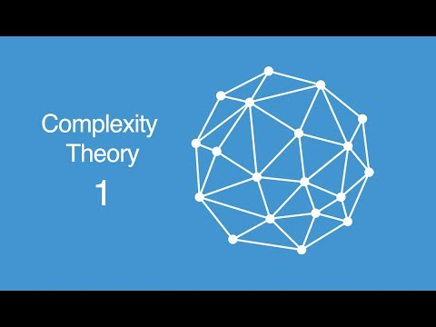
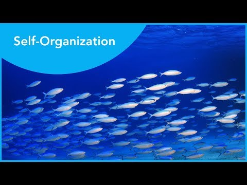

# (PART) Introduction {-}

<!-- # HOW TO CITE -->
<!-- # -->
<!-- # Citations go inside square brackets and are separated by semicolons. Each citation must have a key, composed of ‘@’ + the citation identifier from the database, and may optionally have a prefix, a locator, and a suffix. Here are some examples: -->

<!-- # Blah blah [see @doe99, pp. 33-35; also @smith04, ch. 1]. -->
<!-- # Blah blah [@doe99, pp. 33-35, 38-39 and *passim*]. -->
<!-- # Blah blah [@smith04; @doe99]. -->

<!-- # A minus sign (-) before the @ will suppress mention of the author in the citation. This can be useful when the author is already mentioned in the text: -->

<!-- # Smith says blah [-@smith04]. -->

<!-- # You can also write an in-text citation, as follows: -->

<!-- # @smith04 says blah. -->
<!-- # @smith04 [p. 33] says blah. -->

# **A Quick Guide to Scientific Rigour**

> "Meanwhile our eager-beaver researcher, undismayed by logic-of-science considerations and relying blissfully on the “exactitude” of modern statistical hypothesis-testing, has produced a long publication list and been promoted to a full professorship. In terms of his contribution to the enduring body of psychological knowledge, he has done hardly anything."
>
> ---Paul Meehl [-@meehl1967a, p. 114]     

Before we can begin our introduction to the wonderful world of Complex Adaptive Systems and Complex Networks, we briefly discuss the philosophy of science and perspective on the goal of scientific inquiry that is used throughout this book. This will allow us to highlight some differences between the **Complex Systems Approach (CSA)** we propose for the scientific study of human nature and the perspective (implicitly) used in most disciplines of the social and life sciences, we will call the **Machine Metaphor Approach (MMA)**, **Cognitivism**, or, **Computationalism**.

Use of the [**scientific method**](https://en.wikipedia.org/wiki/Scientific_method) is what separates scientific, from non-scientific claims about the nature of reality. It consists of all philosophical, theoretical, and empirical tools that can be used to systematically evaluate the veracity of such explanatory claims. The repeated application of the scientific method, to study scientific questions, promises to generate **valid** (accurate) inferences and **reliable** (precise) facts about a certain explanatory domain. It does not guarantee that any kind of absolute 'truth' will be discovered.


```{block, vid3, type='rmdentertain'}
<span style="font-size:90%;">
The '**scientific method song**' discusses the most important phases of the *empirical cycle*. Be aware that there is also a *theoretical cycle* and a *diagnotsic cycle*. </br></span>

[](https://youtu.be/KIFz_-KzURY)
```

One factor affecting the perceived veracity of scientific inferences, is the quality of the body of scientific knowledge from which the inferences were deduced, induced or abducted. For example, when a *crisis of confidence* about the trustworthiness of facts in the scientific record generated by some sub disciplines of psychological science was suggested [@pashler2012a], the immediate consequence was that the veracity of all claims by psychological science was called into question.

## Rigorous Open Science

Less tangible, but not less important for the perceived veracity of scientific knowledge are concepts such as *intellectual honesty* and *scientific integrity* of the scientists laying explanatory claims on some domain in reality. Merely checking whether the scientific method has been applied does not fully grasp all the prerequisites for generating a solid body of knowledge. We will use the term **rigorous open science** to denote the ideal set of conditions that should be in place to allow us to distinguish scientific claims that are likely to be false, from claims that are likely to be true, given the perceived *verisimilitude* (truth-likeness) of the knowledge accumulated in the scientific record. 


```{r rigorous, echo=FALSE, fig.cap="Rigorous Science according to @casadevall2016a."}
knitr::include_graphics("images/F1_large.jpg")
```

When a claim is based on [**Scientific Rigour**](http://mbio.asm.org/content/7/6/e01902-16.full) [@casadevall2016a], we mean it was posited based on the following set of principles:

1. **Experimental Redundancy** - The claim has been examined by all methodological and analytical tools that are available and are appropriate given the context. Rigorous Science does not rely on one type of experimental design or one type of statistical analysis.
2. **Recognition of Error** - Without failure there can be no progress, therefore we should carefully study failures and not just report success stories. Any sources of error should be carefully studied and reported to the scientific community.
3. **Sound Probability & Statistics** - Use of the most recent and appropriate statistical theories, models and analytical techniques. Statistical modelling techniques become more realistic over time and often the models that were taught in undergraduate statistics courses have long been replaced and should not be used any more.
4. **Efforts to Avoid Logical Traps** - When generating theories and defining constructs and laws, make sure logical inconsistencies are avoided. When making inferences, avoid the common logical traps such as *The Effect = Structure Fallacy* in null hypothesis significance testing (NHST).
5. **Intellectual Honesty** - Rigorous science is ethical, has integrity and thrives on critical reflection on scientific practice. The right mindset is *"Prove yourself wrong!"*, not *"Prove yourself right!"*

We add to the list that science must be open and transparent. This may seem like an obvious statement to a fresh student of human behaviour, but concepts that make up an essential part of the scientific debate in 2017, such as *open science*, *open data*, *reproducibility*, *Questionable Research Practices (QRPs)*, *Hypothesizing After the Results are Known (HARKing)* and *preregistration*, were practically unknown 5 years ago.


```{block, vid2, type='rmdentertain'}
 <span style="font-size:90%;">
Comedian John Oliver discusses how and why media outlets so often report untrue or incomplete information as science: </span>

[](https://www.youtube.com/watch?v=0Rnq1NpHdmw)
```


### Strong Inference {-}

> A difficulty of much psychological theorizing is vagueness in the terms employed. In this work, the above ideas have been studied in mathematical form throughout, the definitions and proofs being given corresponding precision.
>
> ---W. R. Ashby in 'The Physical Origin of Adaptation by Trial adn Error' [-@ashby1945a, p. 13]


*The Effect = Structure Fallacy* refers to the logical error that occurs a predicted effect is observed (i.e. a statistically significant test result leads to a rejection of the null hypothesis), it is not valid to infer the existence of the assumed cause was evidenced. NHST is based on *the falsification principle*, which means the perceived veracity of a scientific claim will increase only if it has resisted many rigorous attempts to prove it is wrong. If a scientific claim has a large track-record of resisting falsification attempts, we can call it plausible, or high in verisimilitude, but this could all change with one crucial experiment. Contrary to what some scholars suggest, falsifiability is not optional in a rigorous science [@lebel2017falsifiability].

An excellent recipe for a rigorous application of the scientific method was provided by @platt1964strong. Perhaps we should implement it and get us out of the curious situation in which so many different "theories" competing to explain the same pehnomena can be considered to be "true" at the same point in time.     


```{r stronInf, echo=FALSE}
df<-rbind.data.frame(
  r1 = "Devising alternative hypotheses",
  r2 = "Devising a crucial experiment (or several of them), with alternative possible outcomes, each of which will, as nearly as possible, exclude one or more of the hypotheses",
r3 = "Carrying out the experiment so as to get a clean result",
r4 = "Recycling the procedure, making subhypotheses or sequential hypotheses to refine the possibilities that remain",
r5 = "and so on.")
colnames(df) <- c("Strong inference consists of applying the following steps to every problem in science, formally and explicitly and regularly:")
rownames(df) <- c("1.","2.","3.","1'","...")

knitr::kable(df,
             booktabs = TRUE,
             row.names = TRUE,
             format = getOutFormat,
             escape = ifelse(all(getOutFormat%in%c("html","docx")),TRUE,FALSE),
             caption = "Strong Inference according to @platt1964strong ") %>%
  kable_styling(latex_options = c("striped", "scale_down"),
                bootstrap_options = c("striped","responsive", "condensed"),
                font_size = 10)

```


## Theoretical Tunnelvision

> "It is the theory that decides what we may observe"
>
> ---Einstein (as quoted by Heisenberg) 

Many of the initiatives proposed to improve the social and life  sciences focus on improving methodology and statistics. This is understandable, it's where errors are easily made (and discovered) and it allows for relatively simple interventions, e.g. more stringent control on appropriate use of statistics by journals. However, the goal of generating empirical facts is ultimately because we want to find out which scientific claim about the structure of reality best explains why those empirical facts were observed.

The quote attributed to Einstein refers to an important, and grossly underestimated phenomenon one might call the *theoretical tunnelvision*. It is best explained by an example that is commonly encountered in the literature in psychological science and goes something like this:

1. A study tries to find independent causes (predictors) of a certain disease-entity, a pathological state or behavioural mode people can 'get stuck in'.
2. Typically, a statistical model fitted on a large, representative sample of individuals in which many different predictors were measured will yield associations between predictor and disease-entity that are significant but small (on average $r \approx 0.3$, or $\approx 9\%$ explained variance). 
3. Often, if other known (non-clinical) covariates are included in a model, or, if the multivariate nature of the phenomenon is taken seriously by including repeated measurements and/or multiple dependent variables, these predictors will no longer explain any unique variance in the outcome measures.


Here's an example of a 'predictor' study [@walker2015a] to find predictors of  persistence of Major Depressive Disorder MDD 10 over the course of 10 years in a representative sample of 331 individuals who suffered MDD 10 years earlier:

> "Clinical variables in this analysis were not strongly associated with persistence of MDD over the course of 10 years. Comorbid generalized anxiety disorder, baseline depression severity, and taking a prescription for nerves, anxiety, or depression were significantly associated with persistent depression in the unadjusted logistic regression models, but the associations became non-significant when in the multivariate model. These findings are in contrast to the results from several other studies." 

The study concludes by discussing three factors that play a statistically significant role in the persistence of MDD (text between brackets not in original):

* "*having two or more chronic medical conditions [in 1995-1996] contributes to experiencing depression ten years later.* [2.89 more likely] *However, only having one chronic medical condition did not increase the odds of being classified as having MDD in 2004–2006.*"
* "*days of activity limitation in 1995–1996 were significantly associated with a greater risk of depression ten years later,* [2.19 more likely] *independent of the number of chronic medical conditions a person had.*"
* "*Individuals who were in contact with family less than once a week* [in 1995-1996] *were more likely to have MDD in 2004–2006.* [2.07 more likely] *Likewise, people who were married were less likely to have persistent depression compared to those who have never married* [never married 2.42 more likely]"


### So? What's wrong? {-}

So what's wrong with these inferences? The study shows some previous assumptions about the relevance of clinical predictors should be reconsidered, and it adds to scientific record some facts about risk factors that might have eluded scientists, clinicians and health professionals. Let's look at the main conclusion of the study, in addition to a plea for more attention for people with two or more chronic medical conditions, @walker2015a end the article with:

> Future research should continue to examine the complex nature of the relationship between chronic medical disorders and comorbid psychiatric conditions. Addressing these conditions and strengthening social support systems could be important strategies for reduce the burden of depression.

Here's what is odd from the perspective of *rigorous science*:

1. If clinical predictors play no role in explaining why some people remain depressed for such long periods of time, why isn't the main conclusion of the study that we must re-appraise the scientific theories laying explanatory claim on the aetiology of MDD? It is from these theories that the diagnostic tools, the medical, and psychological interventions to which these patients have been exposed, were derived. 

2. Even though the authors acknowledge --and indeed show-- that the propagation of a pathological state like MDD over many years is a very complex multivariate phenomenon, their suggestion for future research is still based on an implicit assumption about causation that is extremely simple. The idea is that there is a chain of unique (efficient) causes, each contributing independently to the emergence, and persistence in time of the MDD state. The authors basically suggest some component causes have to be added to the aetiology. The metaphor is that of a *machine* of which the sum output of its constituent components is equal to the purpose or function of the machine as a whole. Should a component fail, then it can be repaired or replaced as long as it performs the same function as the defective part, thereby restoring the function of the machine as a whole. This is why the authors suggest that strengthening social support systems could be an intervention to reduce the burden of depression: The absence of a partner or visits by family members were predictors that explained some unique variance in the data on the persistence of MDD. Obviously, restoring this defective social support component should restore or at least facilitate the escape from the MDD state. Meanwhile, they seem to forget that they convincingly argued that MDD is a very complex phenomenon that cannot be dissected into neat, independent component causes.

3. Very much related to the previous point: The authors mention three important factors in the discussion and conclusion section, however, the results section contains another factor that was omitted, it is in fact the second most important predictor of the persistence of MDD: 

> "Women had 2.48 the odds of remaining depressed compared to men"

Why did they ignore this predictor in the discussion? This is speculation, but could it be that this factor is not mentioned because it would have to be considered a 'deficient' component and suggesting any kind of 'treatment' intended to 'repair' it is of course beyond the realm of sane things to suggest. Nevertheless, it does seem rather important to figure out why women are 2.5 times more likely than men to still be depressed after 10 years. Perhaps *not* considering gender to be a unique causal component in a chain of *in*dependent predictors might help. Instead, gender could be considered a complex aggregate, or, contextual variable that is associated to the dependent variable through a vast network of *inter*dependent facts, events and states of affair. An obvious factor of importance is that effect-studies of medical interventions are mainly conducted on white, male, 20-30 year old, right-handed, subjects with above average SES. Also, it is likely that on average, the stability of mood over longer periods of time is more variable in women than in men due to fluctuations of hormone levels, but also due to antenatal and postnatal depression [@world2002a]. It does not seem unreasonable to suggest this poses extra challenges for women who want to escape the MDD state.


### No such thing as theory-free 'facts' {-}

The analytical tools selected by the researchers (a generalized linear statistical model) restricts the kinds of associations we might observe in the data. In the the present case all associations will --after transformation-- be linear compositions of independent components.^[Naturally, if one would use mixed models we can account for dependencies in the data, but they will still be limited to linear associations.] One never reads this valid equally valid conclusion: "*We conclude that the linear model is inadequate to describe the complexity of this phenomenon.*" The reason is that the implicit assumptions about causality underlying scientific claims never enter the empirical cycle and therefore escape falsification by the repeated application of the scientific method even though those causality assumptions are also based on a scientific theory about the structure of reality that is in principle falsifiable.


## *Study Materials* {-}

### Phenomena, theories, facts and laws {-}

> "All science is either physics or stamp collecting."
>
> ---Ernest Rutherford (Physics Nobel Laureate, 1872-1937)


It's important to distinguish between phenomena, hypothesis, theory and law. For example, we will be discussing, [nonlinear *phenomena*](#Nonl49), [catastrophe *theory*](#Cata9) and [power *law* scaling](#Powe58).

The video is provides a very clear explanation of the differences between these concepts.

```{block2, fact_hypo, type='rmdimportant'}

[](https://youtu.be/lqk3TKuGNBA)

```

You might also want to refresh your knowledge about some important aspects of scientific theorising about reality: *Ontology* and *Epistomology*

```{block2, onto, type='rmdimportant'}
<span style="font-size:90%;"><b>Ontology.</b></span>

[](https://youtu.be/FN2zwqE_Qo0)

```


```{block2, epis, type='rmdimportant'}
<span style="font-size:90%;"><b>Epistemology</b></span>

[](https://youtu.be/jRxoHtGa4NM)

```


*Intellectual Honesty* and *Epistemic Responisiblity*:

```{block2, epiR, type='rmdimportant'}
 <span style="font-size:90%;"><b>Epistemic Responsibility</b></span>

[](https://youtu.be/AYkhlXronNk)
```


# **Introduction to Complexity Methods**

Psychological systems are biological systems which are physical systems that are alive. Therefore, any theory that lays explanatory claim to phenomena of the mind, ultimately must be a theory about how a physical system is able to accumulate non-random order into its internal structure that appears to codetermine its behaviour. Less formally stated, a science that studies the behaviour of physical systems that are alive, that appear to have a memory which makes their behaviour adaptive, future oriented and intelligent, should be grounded in physical and biological principles and laws.

For now, generating such a theory might be a bridge too far [however, see @turvey2012a], the least we may demand is that our current theories of human behaviour should *not* contradict highly corroborated theories of physics that describe (constituent components of) simple or complex dynamical systems. This is arguably not the case in current psychological theorising, theories assume internal, highly organised structures (such as mental representations) as causes for behaviour, without explaining where the order came from, or how it is maintained or increased. Well studied and formally defined constructs from other scientific disciplines are often imported at a metaphorical level, or are misinterpreted and essentially wrong. For example, *plasticity*, *holism*, *behavioural state/mode/change*, and especially, any concept related to the term *information* (computation, coding/decoding, information processing/storage/retrieval, entropy, etc.). Information is a formally defined quantity that resolves uncertainty about the states or properties of a theoretical object of measurement (e.g. a system, a signal) relative to its degrees of freedom, by assigning it (the uncertainty), a value. If a system represents 1 bit of information (e.g. a coin-toss system), this means it means it can be in 1 of 2 states, or have one of 2 distinct values. 

This is clearly not the same as "meaning" with which it is often conflated in theorising about cognition and behaviour. Shannon lucidly explained this in his seminal paper, which was to be the start of a new scientific discipline, information theory:

> "The fundamental problem of communication is that of reproducing at one point either exactly or approximately a message selected at another point. Frequently the messages have *meaning*; that is they refer to or are correlated according to some system with certain physical or *conceptual entities*. These *semantic aspects of communication* are irrelevant to the engineering problem. The significant aspect is that the actual message is one selected from a set of possible messages. The system must be designed to operate for each possible selection, not just the one which will actually be chosen since this is unknown at the time of design."
>
> ---Shannon (1948, p.379)
      


## The Complex Systems Approach

The *Complex Systems Approach* to behavioural science departs from the assumption (which is probably not very constroversial) that human behaviour originates from a complex adaptive system.

A *system* is an entity that can be described as a composition of components, according to one or more organizing principles. The organizing principles can take many different forms, but essentially they decide three important features of systems that have to do with the relationship between parts and wholes and therefore whether we would call a system complex or not.   

In order to find out what kind of system we are dealing with, we can ask three basic questions:    

1. What are the relevant scales of observation of the system?
2. What are the relevant phenomena that may be observed at the different scales of observation, and are there any interactions across the relevant scales of observation that are needed to explain the relevant phenomena?
3. Can interactions with the internal and external environment of a system occur, and if so, do these interactions have any after-effects on the structure and/or behaviour of the system?

If the answer to the first question is "many" and to the second and third "yes" it is very likely we are dealing with a complex dynamical system.

So let's look at some properties of this system that generates human behaviour, it's a system:

* ... which has many different constituent parts, and those parts are often also systems with many different constituent parts (the tRNA system, the prefrontal cortex, the respiratory system, the speech system, the endocrine system, the microbiome, etc.).
* ... that is *open* and can exchange energy, matter and information with its internal and external environment, as a consequence, dissipating heat (disorder, entropy) back into the environment.
* ... which has many different internal states that can have their own specific dynamics, sometimes appearing to be independent of, but oftentimes coupled to, the dynamics of other internal states (emotional states, motivational states, attentional states, physical fitness, general health, biological development, etc.).
* ... in which there are many potential levels of organisation and, therefore, potentially many different levels of analysis (cognitive development, cognitive neuroscience, lifespan IQ, socio-cultural differences in IQ, etc.).
* ... in which many processes operate on, and, interact across, many different spatial and temporal scales (Studying proficiency at playing chess: social/cultural/pedagogical/genetic contexts, development of social/emotional/motor/cognitive skills, availability/quality of education, motivation, personality, etc.). 

So... that's probably a *yes* on complex dynamical system. To be more specific, we can state that most living organisms, including human beings, are **complex adaptive systems with internal state dynamics**.


## Ergodicity and the Measurment Problem

It does not take an expert on *population statistics* to see there is probably a mismatch between the interesting behavioural phenomena and the analytical toolbox most frequently used to study human behaviour in the social and life sciences. Anyone who took an introductory class in inferential statistics will remember the assumptions of statistical models require observations to be independent of one another, variances to be homogeneous (e.g. Levene's test), and measurement error to be essentially random in nature and normally distributed, not correlated to any other factors that might cause the phenomenon under scrutiny. 

Given the nature of the phenomena of interest and the properties of the system under scrutiny, there are two main concerns about the scientific study of human behaviour:

1.	The assumption that *the ergodic theorems apply* to the theoretical objects of measurement and data generating processes [@molenaar2004a; @molenaar2008a]: Ensemble averages of variables observed in samples of sufficiently many individuals are expected to be arbitrarily similar to the time averages of variables evolving over a sufficiently long interval of time, from any single initial condition. 
2.	The assumption that the interpretation of outcomes of psychological measurement is, or should be, equivalent to *classical physical measurement* [@RN5]: It is considered unproblematic to interpret a measurement outcome as a property of the theoretical object of measurement confounded by some random additive measurement noise or sampling error.

The validity of the assumptions related to ergodicity (i.e. stationarity and homogeneity of central moments) are obviously important for making valid statistical inferences and generalizations. However, even if some of the core assumptions for an ergodic data generating process are formally valid, one cannot rely on parameter estimates to converge on a characteristic expected value within the time scale of observation, or, scale of fluctuation, as is the case when the process samples from a stable distribution with one or more undefined central moments like the Cauchy distribution. This has led some scholars to suggest that "*the very notion of probability may not make sense*" [@RN6] when studying complex systems with internal state dynamics.

Recent observations of discrepancies between inferred properties at the ensemble level (inter-individual) and the individual level (intra-individual), have been suggested as a cause of the so-called reproducibility crisis in the social and life sciences [@RN7;@RN8;@RN9]. A study which observed a lack of ‘group-to-individual generalizability’ in the context of psychopathology described the phenomenon as a threat to human subjects research: “*In clinical research, diagnostic tests may be systematically biased and our classification systems may be at least partially invalid. In terms of theory development, we may have a misleading impression about the nature of psychological variables and their interactions.*” [@RN8]. A study of the neuroanatomical phenotypes of schizophrenia and bi-polar disorder [@RN9] concluded: “*This study found that group-level differences disguised biological heterogeneity and interindividual differences among patients with the same diagnosis. This finding suggests that the idea of the average patient is a noninformative construct in psychiatry that falls apart when mapping abnormalities at the level of the individual patient.*”


The second concern is about the lack of a clear notion in psychology and the life sciences of how to incorporate the measurement context and the act of measurement into the description of a phenomenon [@RN10]. Psychological measurement is an interaction between a (prepared) theoretical object of measurement and the elements of the measurement procedure (experimental design, instruments, etc.). The very act of asking someone to project their current internal state of happiness onto an arbitrary ordinal scale will interfere with their “true” state of happiness (if such a thing even exists without the measurement context). There is no “happiness” equivalent for unobtrusive measurement of body temperature using an infra-red camera.

Resolutions to these and other problems with psychological measurement have been proposed, for example the various types of conjoint measurement [@RN5; @RN11], or suggestions to adopt concepts from quantum measurement [@RN10; @RN12]. However, when measurement and analysis of the temporal evolution of internal states is concerned, problems arise due to the fact that living systems are subject to *ageing* (loss of identity over time) and appear to be able to coordinate their current behavior relative to some record of previously experienced events. In more general terms, the behavior of a complex adaptive system will display after-effects of interactions with its internal or external environment that extend far beyond any timescale that might be understood as a simple stochastic process with autoregressive components. Time series of observables of living systems will often lack the memoryless-ness property [@RN13; @RN14], suggesting anomalous, rather than normal diffusion processes should be considered as a model for the data generating process [@RN15].


## Component- vs. Interaction-dominant Dynamics

A helpful framework for discussing the differences between a Complex Systems Approach and a Machine Metaphor Approach to the scientific study of human behaviour is to describe the causal ontology used to explain behaviour. Familiar “degrees of causation”, or entailment are possible in component dominant dynamics, such as uniquely explained variance, beta weights or effect sizes. In general, a linear arrangement of partial causes always neatly sum up to produce the behaviour of interest. An alternative causal ontology is interaction dominant dynamics in which not the components themselves, but their interactions as a whole are the source of the observed behaviour (Ihlen & Vereijken, 2010; Kello, Beltz, Holden, & Van Orden, 2007; Van Orden, Holden & Turvey, 2003; Van Orden, Holden & Turvey, 2005; Wijnants, Cox, et al., 2012). Here the contribution of components is not additive, but multiplicative and nonlinear (Holden et al., 2009; van Rooij, Nash, Rajaraman, & Holden, 2013). Such interaction dominant dynamics render individual component behaviour (which are still posited to exist), such as poor performance on ability X, impaired representation of that feature Y, as a less interesting object of theoretical and empirical inquiry. 


```{r fig.align='center', echo=FALSE, include=identical(knitr:::pandoc_to(), 'html')}
knitr::include_graphics('images/intdom.png', dpi = NA)
```

As a consequence, theoretical and empirical inquiry is aimed at identifying and understanding the contexts in which impaired behaviour emerged. Adopting such a perspective entails that all observable behaviour can only be understood relative to the context in which it was observed, that is, the measurement context (cf. Holden, Choi, Amazeen, & Van Orden, 2010; Van Orden, Kello, & Holden, 2010). Figure  presents the fundamental differences between the two ontologies in their assumptions about the causes of behaviour and their assumed place of measurement. Figure  may reveal why the nature of cognitive components and processes remain elusive in their causal role. They are inferred, not postulated, based on data from different places of measurement. Their causal structure does not incorporate the nested nature of both measurements as well as posited entities. Applying the concept of the complex conditional reveals hierarchical dependencies of one condition on another and such a complex, if it were composed of the correct conditionals, should be considered as a whole. As a consequence, impaired behaviour should be understood as emerging from the whole of constituent components, not from an individual component. The notion of a cause is somewhat more radical than the complex conditionals and is known as impredicative, circular causation (Chemero & Turvey, 2010; Freeman, 1999; Turvey, 2007), or nested causation.


## A Behavioural Science of the Individual?

The dictum "first analyze, then aggregate" [by Peter Molenaar as quoted in @rose2016a], advocates an order reversal of the methods commonly employed by the behavioural sciences to advance scientific knowledge: Measurement outcomes of psychological variables observed in samples of individuals that share some identity are first aggregated, then analyzed, in order to decide whether the statistical properties of the variables realized in the sample can be considered general regularities or true characteristics of the identity under scrutiny. As such, nomothetic behavioural science produces knowledge about psychological and behavioural phenomena that are expected to be robust at the level of aggregated wholes. However, contrary to the applied branches of economic, sociological and political science, the scientist practitioner generally does not deal with the behaviour of aggregated wholes such as economies, societies and groups of voters. The domain in which they have to apply this knowledge concerns the explanation, intervention, or prediction of the behaviour of particular patients, children, or employees, that is, they deal with the individuals that constitute the aggregated wholes. As mentioned earlier, recent studies have shown that applying the statistical syllogism to nomothetic knowledge in psychology may be very problematic.

One could argue that the rules of sample-based statistical inference do not warrant generalizations to a particular case, so one should not engage in such inductive reasoning in the first place. This is of course an unsatisfactory solution and about 15 years ago Molenaar presented an alternate path for psychological science in a paper entitled: "A Manifesto on Psychology as Idiographic Science: Bringing the Person Back Into Scientific Psychology, This Time Forever" [@molenaar2004a]. It's still too early to call whether it will indeed be forever, but the past decade did see a surge of scientific studies employing a person-centered or idiographic approach, most prominently in the field of psychopathology. Many researchers have been exploring what can be described as a small data paradigm [cf. @hekler2019a], which departs from the same goals and principles as so-called precision, or personalized medicine [@chan2011a], promising to yield new insights and better tools for scientist practitioners to apply to the particular cases they encounter in their daily practice [see e.g., @schiepek2016b; @david2018a]. In general, the approach entails studying a limited number of cases intensively, for example, by collecting densely sampled multivariate time series data that represent self-reports of emotional states or well-being, using the so-called Experience Sampling Method, or Ecological Momentary Assessment [@wichers2016a; @schiepek2016a; @conner2009a]. Naturally, this change of focus in data collection from static sampling from homogeneous populations, to dynamic process monitoring in individuals is accompanied by the development of new theories, models and analytic techniques, of which the network approach to psychopathology has probably been the most popular and revolutionary approach [cf. @mcnally2019a; @robinaugh2020a].

There appears to be a substantial gap between the conceptual changes in the theoretical ideas about the nature of the system in which psychological phenomena can be observed and the analytic techniques and rules of inference employed to study such systems. Consider the following description of the personalized approach:

>"The personalized approach to psychopathology conceptualizes mental disorder as a complex system of contextualized dynamic processes that is non-trivially specific to each individual, and seeks to develop formal idiographic statistical models to represent these individual processes." [@wright2020a]

Although many studies using the personalized approach indeed depart from the idea that human behaviour, whether pathological or not, should be considered to arise from a complex dynamical system [see e.g., @cramer2016a], few studies actually make use of the methods and analyses from Complexity Science that were developed to study such systems. It appears to be the case that in terms of methods and analytic techniques, the idiographic revolution is taking place right now, but the complexity revolution has yet to occur. Two recent reviews of the personalized approach [@piccirillo2019a;@wright2020a] fail to discusses, or even mention, the use of complexity methods to study multivariate time series data in the context of psychopathology. Such studies do exist and have been a part of the scientific record for at least as long as studies using the Gaussian Graphical Model to model multivariate ESM data [see e.g., @guastello2008a; @delignieres2004a; @van-geert2009a; @lichtwarckaschoff2012a; @schiepek2003a; @schiepek2009a; @olthof2019a; @olthof2019b].

It is the purpose of this book to bridge the gap and introduce complexity methods that will be essential tools for the analytic toolbox of a behavioural science of the individual.


## *Study Materials and Resources* {-}

### Graphical representation of complex system properties {-}

This is a link to a 'cheat sheet'-style document of complex system concepts created by dr. Joanna Boehnert: https://www.cecan.ac.uk/news/the-visual-representation-of-complexity/ 


### The Complexity Explorer Glossary {-}

There is a glossary of terms in [Appendix C](#Terms), but the ultimate glossary can be found on the Complexity Explorer site maintained by the Santa Fé institute: https://www.complexityexplorer.org/explore/glossary/ 


### TED talks {-}

There are quite a lot of interesting [TED talks](https://www.ted.com) on complexity and related topics. Some of them are highlighted here, but you are encouraged to look for them yourself as well.


```{block2, type='rmdimportant'}

**Simplicity in Complexity**


[](https://youtu.be/cOKUs87KbSQ)

```


```{block2, type='rmdimportant'}

**Complex Adaptive Systems**


[](https://youtu.be/jS0zj_dYeBE)

```


### Systems Innovation videos {-}

The [Systems Innovation](https://systemsinnovation.io) platform has lots of resources on Complex Systems, Complex Networks and related topics. Their [YouTube channel](https://www.youtube.com/channel/UCutCcajxhR33k9UR-DdLsAQ) contains a wealth of informative videos. 


```{block2, type='rmdimportant'}

**A working definition of complex systems**    
  
[](https://youtu.be/vp8v2Udd_PM)

```


```{block2, type='rmdimportant'}

**Self-organization**    

[](https://youtu.be/pbu80EEnh8E)

```


```{block2, type='rmdimportant'}

**The butterfly effect**     


[](https://youtu.be/1xn98WnMxMs)

```


<!-- ---- -->
<!-- [^assumptions]: [Retreived from www.statsoft.com](https://www.statsoft.com/Textbook/ANOVA-MANOVA#sphericity) -->
<!-- [^einstein]: Einstein as quoted by Heisenberg. -->
<!-- [^ergodic]: See  Dajani &  Dirksin (2008, p. 5, ["A simple introduction to Ergodic Theory"](http://www.staff.science.uu.nl/~kraai101/lecturenotes2009.pdf)) -->


<!-- ### Open vs. Closed -->

<!-- A closed system cannot exchange any energy, matter or information with the external environment. -->

<!-- ### Simple vs. Complex -->


<!-- ### Ergodic vs. Non-ergodic -->
<!-- [@Molenaar2008a,@Molenaar2009a] -->

<!-- ### Equilibrium vs. Far-from-equilibrium -->


<!-- ### Order vs. Disorder -->

<!-- > "order is essentially the arrival of redundancy in a system, a reduction of possibilities" -->
<!-- > -->
<!-- > --- Von Förster (2003)  -->

<!-- The arrival of redundancy is an excellent description of what is meant by *nonrandom* behaviour. If the behaviour of a system is redundant, this means it is predictable to some extent and this just refers to the fact that behaviour covaries systematically (is correlated) with the behaviour of other parts of the system, or with changes in the external environment. The presence of redundancies indeed implies a reduction of possible states the system has available to generate its behaviour, the states a system can be in are in some way dependent on the temporal evolution of parts of the internal or external environment, they can no longer be occupied independently. This phenomenon id often described as a *constraint on the degrees of freedom* a system has available to generate its behaviour. The appearance of order always implies that states that were previously part of the behaviourial repertoire, are no longer accessible by the system. -->

<!-- The opposite of order, *disorder*, or randomness, must then refer to the absolute absence of any redundancies, making reliable prediction of system behaviour impossible, or, equilly reliable to what may be expected by chance. The amount of disorder in a system can be quantified, a measure known as the Entropy of a system. -->


<!-- ### Order vs. Deterministic Chaos -->


<!-- ## **A Causal Ontology of Interaction Dynamics** -->


<!-- ### Holism and Emergence -->

<!-- >"A physical theory is holistic if and only if it is impossible in principle, for a set of local agents each having access to a single subsystem only, to infer the global properties of a system as assigned in the theory (which can be inferred by global measurements), by using the resource basis available to the agents." -->


<!-- ### -->

<!-- ## **State Space** -->


<!-- ## **Phase Space** -->


<!-- ## **The Attractor Ladscape** -->


<!-- **Equilibrium State** -->
<!-- It occurs when a dynamic system has a configuration C with the properties that -->
<!-- a. if started at C and released, it does not move from C, and  -->
<!-- b. if started at any configuration near C, the system changes in time towards C. -->

