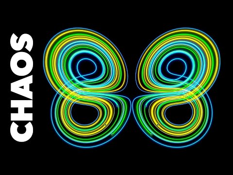
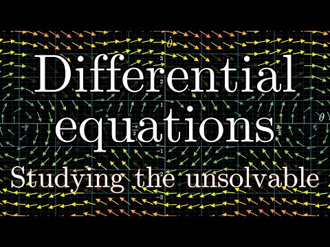

# (PART) Mathematics of Change {-} 


# **Introduction to the Mathematics of Change** 

The simplest non-trivial *iterative change process* can be described by the following *difference equation*: 

$$ Y_{i+1} = a*Y_i $$    

The equation describes the way in which the value of $Y$ changes [between two adjacent, **discrete** moments in time](https://en.wikipedia.org/wiki/Discrete_time_and_continuous_time) 
(hence the term [difference equation, or recurrence relation](https://en.wikipedia.org/wiki/Recurrence_relation)). There are two parameters resembling an intercept and a slope:

1. The starting value $Y_0$ at $i=0$, also called the *starting value*, or the *initial conditions*.
2. A rule for incrementing time, here the change in $Y$ takes place over a discrete time step of 1: $i+1$.    
    
The values taken on by variable $Y$ are considered to represent the states  quantifiable observable  alternative ways to describe the change of states :

* A dynamical rule describing the propagation of the states of a system observable measured by the values of variable `Y` through discrete time.
* A dynamic law describing the time-evolution of the states of a system observable measured by the variable `Y`.   
    
These descriptions all refer to the change processes that govern system observables (properties of dynamical systems that can be observed through measurement).     

## **It's a line! It's a plane!** 
The formula resembles the equation of a line. One could consider the value $Y_{0}$ a constant like the intercept of a line. The proportion of the value of $Y$ at time $i$ by which $Y$ changes is given by parameter $a$. This is similar to the slope of a line. However, in a 2D $(X,Y)$ plane there are two 'spatial' (metric) dimensions representing the values two variables $X$ and $Y$ can take on (see figure), in the case of a time series model, the $X$-axis represents the time dimension.

```{r plane, echo=FALSE, message=FALSE, warning=FALSE}
set.seed(12346)
y1 = cumsum(rnorm(n=21,mean=5,sd=100))
x1 = -10:10
plot(x1,y1, type="p", lwd=2, xlim=c(-12,12), yaxt="n", xlab="X", ylab="Y", main = "2D Euclidean Space")
abline(h=0,v=0,lty=2)
l1 <- lm(y1~x1)
lines(x1,coef(l1)[1]+x1*coef(l1)[2],type="l",lwd=3)
text(1.5, y1[11], expression(Y[X==0]),col="grey60")
text(11.5, y1[21], expression(Y[X==10]),col="grey60")
text(-11.5, y1[1], expression(Y[X==-10]),col="grey60")
```

The best fitting straight line through the points in the $(X,Y)$ plane is called a statistical model of the linear relationship between the observed values of $X$ and $Y$. It can be obtained by fitting a General Linear Model (GLM) to the data. If $X$ were to represent repeated measurements the multivariate GLM for repeated measures would have to be fitted to the data. This can be very problematic, because statistical models rely on the assumptions of [Ergodic theory](https://en.wikipedia.org/wiki/Ergodic_theory): 

> "... it is the study of the long term average behavior of systems evolving in time." 

The ergodic theorems require a process to be stationary and homogeneous (across time and/or different realisations of the process, i.e. between different individuals).

```{block2, type="rmdkennen"}
In other words: If you throw 1 die 100 times in a row, the average of the 100 numbers is the **time-average** of one of the observables of die-throwing systems. If this system is ergodic, then its **time-average** is expected to be similar to the average of the numbers that turn up if you throw 100 dice all at the same instance of time. The dice layed out on the table represent a spatial sample, a snapshot frozen in time, of the possible states the system can be in. Taking the average would be the **spatial average** this observable of die-throwing systems. This ergodic condiciotn is often implicitly assumed in Behavioural Science when studies claim to study change by taking different samples of individuals (snapshots of system states) and comparing if they are the same. 
```

One also needs to assume the independence of measurements within *and* between individual realisations of the process. These assumptions can be translated to certain conditions that must hold for a (multivariate) statistical model to be valid. Some well known conditions are *Compound Symmetry* and *Sphericity*:    

> The compound symmetry assumption requires that the variances (pooled within-group) and covariances (across subjects) of the different repeated measures are homogeneous (identical). This is a sufficient condition for the univariate F test for repeated measures to be valid (i.e., for the reported F values to actually follow the F distribution). However, it is not a necessary condition. The sphericity assumption is a necessary and sufficient condition for the F test to be valid; it states that the within-subject "model" consists of independent (orthogonal) components. The nature of these assumptions, and the effects of violations are usually not well-described in ANOVA textbooks; [^assumptions]   

As you can read in the quoted text above, these conditions must hold in order to be able to identify unique independent components (i.e. the linear predictor $X$) as the sources of variation of $Y$ over time within a subject.

If you choose to use GLM repeated measures to model change over time, you will only be able to infer independent components that are responsible for the time-evolution of $Y$. As is hinted in the last sentence of the quote, the validity of such inferences is not a common topic of discussion statistics textbooks. 


## **No! ... It's a time series!**

The important difference between a regular 2-dimensional Euclidean plane and the space in which we model change processes is that the $X$-axis represents the physical dimension **time**. In the case of the Linear Map we have a 1D space with one 'spatial' dimension $Y$ and a time dimension $t$ (or $i$). This is called a *time series* if $Y$ is sampled as a continuous process, or a *trial series* if the time between subsequent observations is not relevant, just the fact that there was a temporal order (for example, a series of response latencies to trials in a psychological experiment in the order in which they were presented to the subject).

```{r plane1, echo=FALSE}
plot(0:20,y1, type="b", lwd=2, xlim=c(-2,22), yaxt="n", xlab="Time / Trial series", ylab="Y", main = "1D Euclidean Space")
abline(h=0,v=0,lty=2)
x2 <- (x1+10)
l2 <- lm(y1~x2)
lines(x2,coef(l2)[1]+x2*coef(l2)[2],type="l",lwd=3)
text(-1.2, y1[1], expression(Y[t==0]),col="grey60")
text(21.5, y1[21], expression(Y[t==20]),col="grey60")
```

Time behaves different from a spatial dimension in that it is directional (time cannot be reversed), it cannot take on negative values, and, unless one is dealing with a truly random process, there will be a temporal correlation across one or more values of $Y$ separated by an amount of time. In the linear difference equation this occurs because each value one step in the future is calculated based on the current value. If the values of $Y$ represent an observable of a dynamical system, the system can be said to have a history, or a memory.

Ergodic systems do *not* have a history or a memory that extends across more than a sufficiently small time scale (e.g. auto-correlations at lags of ±1-5 can be expected, but there should be no systematic relationships that span several decades). Assuming such independence exists is very convenient, because one can calculate the expected value of a system observable (given infinite time), by making use of of the laws of probabilities of random events (or random fields). This means: The average of an observable of an Ergodic system measured across infinite time (its entire history, the **time-average**), will be the be the same value as the average of this observable measured at one instance in time, but in an infinite amount of systems of the same kind (the population, the **spatial average**) [^dice]. 

The simple linear growth difference equation will always have a form of *perfect memory* across the smallest time scale (i.e., the increment of 1, from $t$ to $t+1$). This 'memory' just concerns a correlation of 1 between values at adjacent time points (a short range temporal correlation, SRC), because the change from $Y_t$ to $Y_{t+1}$ is exactly equal to $a * Y_t$ at each iteration step. This is the meaning of deterministic, not that each value of $Y$ is the same, but that the value of $Y$ now can be perfectly explained form the value of $Y$, one moment in the past.

Summarising, the most profound difference is not the fact that the equation of linear change is a deterministic model and the GLM is a probabilistic model with parameters fitted from data, this is something we can (and will) do for $a$ as well. The profound difference between the models is the role given to the passage of time: 

* The linear difference equation represents changes in $Y$ as a function of the physical dimension *time* and $Y$ itself.
* The GLM represents changes in $Y$ as a function of a [linear predictor](https://en.wikipedia.org/wiki/Linear_predictor_function) composed of additive components that can be regarded as independent sources of variation that sum up to the observed values of $Y$.

Figure \@ref(fig:fun) shows the main differences between the GLM and Differential/Difference equation models.

```{r fun, echo=FALSE, fig.cap="General Linear Model versus Differential/Difference equations"}
knitr::include_graphics("images/functions.png",auto_pdf = TRUE)
```


## **Implementing iterative functions**

Coding change processes (difference equations) in `Matlab` and `R` is always easier than using a spreadsheet. One obvious way to do it is to use a counter variable representing the iterations of time in a `for ... next` loop (see [tutorials](#tutorials)). The iterations should run over a vector (which is the same concept as a row or a column in a spreadsheet: An indexed array of numbers or characters). The first entry should be the starting value, so the vector index $1$ represents $Y_0$.

The loop can be implemented a number of ways, for example as a function which can be called from a script or the command or console window. In `R` working with **functions** is easy, and very much recommended (see [tutorials](#tutorials)), because it will speed up calculations considerably, and it will reduce the amount of code you need to write. You need to gain some experience with coding in `R` before you'll get it right. In order to get it lean and clean (and possibly even mean as well) you'll need a lot of experience with coding in `R`,therefore, we will (eventually) provide you the functions you'll need to complete the assignments in the **Answers** section of the assignments. If you get stuck, look at the answers. If you need to do something that reminds you of an assignment, figure out how to modify the answers to suit your specific needs.

We'll use the linear map $Y_{i+1} = r*Y_i$ as an example and show three different ways to implement iterative processes:

1. The `for...` loop
2. The `-ply` family of functions
3. User defined `function()` with arguments


```{r}
# for loop
N  <- 100
r  <- -.9
Y0 <- 0.01
Y  <- c(Y0,rep(NA,N-1))

for(i in 1:(N-1)){
  Y[i+1] <- r*Y[i]
}
plot(Y,type = "l")


# -ply family: sapply
Yout <- sapply(seq_along(Y),function(t) r*Y[t])
plot(Yout,type = "l")


# function with for loop
linmap1 <- function(Y0,r,N){
  Y  <- c(Y0,rep(NA,N-1))
  for(i in 1:(N-1)){
    Y[i+1] <- r*Y[i]
  }
  return(Y)
}
plot(linmap1(Y0,r,N),type = "l")
```


## **Numerical integration to simulate continuous time**

In order to 'solve' a differential equation for continuous time using a method of numerical integration, one could code it like in the spreadsheet assignment below. For `R` and `Matlab` there are so-called *solvers* available, functions that will do the integration for you. For `R` look at the [Examples in package `deSolve`](http://desolve.r-forge.r-project.org).


### Euler's method and more... {-}

The result of applying a method of numerical integration is called a **numerical solution** of the differential equation. The **analytical solution** is the equation which will give you a value of $Y$ for any point in time, given an initial value $Y_0$. Systems which have an analytical solution can be used to test the accuracy of **numerical solutions**.


### Analytical solution {-}
Remember that the analytical solution for the logistic equation is:

$$
Y(t)  =  \frac{K * Y_0}{Y_0 + \left(K - Y_0 \right) * e^{-r*t} }
$$
This can be 'simplified' to

$$
Y(t)  =  \frac{K}{1 + \left(\frac{K}{Y_0-1} \right) * e^{-r*t} }
$$

If we want to know the growth level $Y_t$ at $t=10$, with $Y_0=.0001$, $r=1.1$ and $K=4$, we can just `fill it in`:
```{r, echo=TRUE, include=TRUE}
# Define a function for the solution
logSol <- function(Y0, r, K, t){K/(1+(K/Y0-1)*exp(-r*t))}

# Call the function
logSol(Y0=.0001, r=1.1, K=4, t=10)

```

We can pass a vector of time points to create the exact solution, the same we would get if we were to iterate the differential/difference equation.
```{r, echo=TRUE, include=TRUE}
# Plot from t=1 to t=100
plot(logSol(Y0=.0001, r=1.1, K=4, t=seq(1,20)), type = "b", 
     ylab = expression(Y[t]), xlab = "t")
# Plot t=10 in red
points(10,logSol(Y0=.0001, r=1.1, K=4, t=10), col="red", pch=16)
```

### Numerical solution (discrete) {-}

If we would iterate the differential equation ...

$$
\frac{dY}{dt} = Y_t * (1 + r - r * \frac{Y_t}{K})
$$

... as if it were a difference equation, we are *not* simulating continuous time, but a discrete time version of the model:

$$
Y_{i+1} = Y_i * (1 + r - r * \frac{Y_i}{K})
$$


```{r, echo=TRUE, include=TRUE}
logIter <-  function(Y0,r,K,t){
  N <- length(t)
  Y <- as.numeric(c(Y0, rep(NA,N-2)))
  sapply(seq_along(Y), function(t){ Y[[t+1]] <<- Y[t] * (1 + r - r * Y[t] / K)})
  }

# Plot from t=1 to t=100
plot(logIter(Y0=.0001, r=1.1, K=4, t=seq(1,20)), type = "b", 
     ylab = expression(Y[t]), xlab = "t")
# Plot t=10 in red
points(10,logSol(Y0=.0001, r=1.1, K=4, t=10), col="red", pch=16)
```


### Euler vs. Runge-Kutta 

The method developped by Runge and Kutta takes a harmonic mean over a number of points, R-K4 takes 4 points, R-K6 takes 6, [but there are many more variants](https://en.wikipedia.org/wiki/Runge–Kutta_methods).

Here's an exampkle with **Predator-Prey dynamics** comparing Euler's method to R-K4.

```{r}
library(plyr)
library(tidyverse)
library(lattice)

# Lotka-Volterra Euler
lvEuler <- function(R0,F0,N,a,b,c,d,h){

  # Init vector
  Ra <- as.numeric(c(R0, rep(NA,N-1)))
  Fx <- as.numeric(c(F0, rep(NA,N-1)))

  for(t in 1:N){
  # Euler numerical solution of the predator-prey model
  Ra[t+1] <- Ra[t] + (a - b * Fx[t]) * Ra[t] * h
  Fx[t+1] <- Fx[t] + (c * Ra[t] - d) * Fx[t] * h
  }
  
  return(data.frame(time=1:NROW(Ra),Ra=Ra,Fx=Fx,method="Euler"))
}

# Lotka-Volterra Runge Kutta 4
lvRK4 <- function(R0,F0,N,a,b,c,d,h){

  # Init vector
  Ra <- as.numeric(c(R0, rep(NA,N-1)))
  Fx <- as.numeric(c(F0, rep(NA,N-1)))

  for(t in 1:N){
  # RK4 numerical solution of the predator-prey model
  k1_R=(a - b * Fx[t]) * Ra[t]
  k1_F=(c * Ra[t] - d) * Fx[t]

  k2_R=(a - b * (Fx[t]+h*k1_F/2)) * (Ra[t]+h*k1_R/2)
  k2_F=(c * (Ra[t]+h*k1_R/2) - d) * (Fx[t]+h*k1_F/2)

  k3_R=(a - b * (Fx[t]+h*k2_F/2)) * (Ra[t]+h*k2_R/2)
  k3_F=(c * (Ra[t]+h*k2_R/2) - d) * (Fx[t]+h*k2_F/2)

  k4_R=(a - b * (Fx[t]+h*k3_F)) * (Ra[t]+h*k3_R)
  k4_F=(c * (Ra[t]+h*k3_R) - d) * (Fx[t]+h*k3_F)

  # Iterative process
  Ra[t+1] <- Ra[t] + (1/6)*h*(k1_R+2*k2_R+2*k3_R+k4_R)
  Fx[t+1] <- Fx[t] + (1/6)*h*(k1_F+2*k2_F+2*k3_F+k4_F)
  }
  
  return(data.frame(time=1:NROW(Ra),Ra=Ra,Fx=Fx,method="RK4"))
}
```

Now that we have the fuctions, we'll plot the numerical solutions for the same set of parameters. The continuous mathematics (= if you do some calculations to find the fixed points of the system) ensure us that the system should be in an equilibrium state in which the populations keep going around in the same cycle of growth and collapse. Let's see what happens...

```{r}
# Parameters
N  <- 2000

# Equilibrium
a  <- 1/6
b  <- 4/3
c  <- d  <- 1
R0 <- F0 <- 0.1

# Time constant
h <- 0.1

# Get the results
pp1 <- lvEuler(R0,F0,N,a,b,c,d,h)
pp2 <- lvRK4(R0,F0,N,a,b,c,d,h)

# Make a long dataframe
pp <- rbind(pp1,pp2)

pp.long <- pp %>%
  gather(key = TimeSeries, value = Y, -c("time","method"))

# Time series plots
ggplot(pp.long, aes(x=time,y=Y,colour=TimeSeries)) +
  geom_line() +
  facet_grid(method~.) +
  theme_bw()

# Phase plane plots
ggplot(pp, aes(x=Ra,y=Fx,colour=time)) +
  geom_path() +
  facet_grid(method~.) +
  xlab("Rabbits") + ylab("Foxes") +
  theme_bw()
```

Using the Euler method predator and prey populations do not 'die out', but in phase space they seem to occupy different behavioural regimes. This looks like an unstable periodic orbit, or an unstable limit cycle, but it is in fact caused by the inaccuarcy of Euler's method. Here *RK4* clearly outperforms *Euler*.


## **Deterministic Chaos**

> “The study of things that look random -but are not”
>
> ---E. Lorenz

[This Google sheet]((https://docs.google.com/spreadsheets/d/1xaZJLYfZzkxg_PXCAa7QT7p4R_JTnUIxzs_Qs1-RAOQ/edit?usp=sharing) displays the extreme sensitivity to changes in initial conditions displayed by the Logistic Map for specific parameter settings. This specific phenomenon is more commonly referred to as **The Butterfly Effect**. It is a characteristic of a very interesting and rather mysterious behaviour displayed by deterministic dynamical equations known as **deterministic chaos**.

```{r sdic, echo=FALSE, fig.cap="Butterfly Effect"}
knitr::include_graphics("images/sdic.png",auto_pdf = TRUE)
```

The Logistic Map is the simplest nontrivial model that can display deterministic chaos. For continuous time models, one needs at least 3 coupled differential equations to generate chaotic behavior. There is no clear definition of deterministic chaos, but there are at least 4 ingredients: The dynamics are **a-periodic**, **bounded** and **sensitively depend on initial conditions**, moreover, the system generating these dynamics is **deterministic**.

The video below by YouTuber [Veritasium](https://www.youtube.com/user/1veritasium) does an amazing job at explaining what deterministic chaos is based on the famous [Lorenz system](https://en.wikipedia.org/wiki/Lorenz_system). 

```{block2, type='rmdkennen'}
*The science behind the butterfly effect*
  

[](https://youtu.be/fDek6cYijxI)


```


## **Modeling interactions between processes and agents** {#advmodels}

### The Competetive Lottka-Volterra Equations 

The coupled predator-prey dynamics in the previous assignment are not a very realistic model of an actual ecological system. Both equations are exponential growth functions, but **R**abbits for example, also have to eat! One way to increase realism is to consider coupled logistic growth by introducing a carrying capacity.   

* Follow the link to this [Wiki page](https://en.wikipedia.org/wiki/Competitive_Lotka–Volterra_equations) and try to model the system!


> This is what *interaction dynamics* refers to, modeling mutual dependiencies using the `if ... then` conditional rules isn't really about interaction, or coupling between processes.


### Predator-Prey (and other) dynamics as Agent Based Models 

Agent-Based models are an expansion of the idea of "connected growers" that includes a spatial location  of the things that is subject to change over time.

Have a look at some of the [NETlogo](http://ccl.northwestern.edu/netlogo/) demo's:

* [Rabbits Weeds Grass](http://www.netlogoweb.org/launch#http://www.netlogoweb.org/assets/modelslib/Sample%20Models/Biology/Rabbits%20Grass%20Weeds.nlogo)
* [Wolf Sheep Grass](http://www.netlogoweb.org/launch#http://www.netlogoweb.org/assets/modelslib/Sample%20Models/Biology/Wolf%20Sheep%20Predation.nlogo)


### The dynamic field model

Probably the most impressive modelling example in developmental psychology is the Dynamic Field Model for infant perservative reaching, also known as the *A-not-B error*:

* [Thelen, E., Schöner, G., Scheier, C., & Smith, L. (2001). The dynamics of embodiment: A field theory of infant perseverative reaching. Behavioral and Brain Sciences, 24(1), 1-34. doi:10.1017/S0140525X01003910](https://www.cambridge.org/core/journals/behavioral-and-brain-sciences/article/dynamics-of-embodiment-a-field-theory-of-infant-perseverative-reaching/1C2802AA1C508444DD6D3C3289141CD8#)

The model makes some very interesting predictions that have been confirmed and it has been generalized to other phenomena and scientific disciplines as well

* [Smith, L. B., & Thelen, E. (2003). Development as a dynamic system. Trends in cognitive sciences, 7(8), 343-348.](https://www.sciencedirect.com/science/article/pii/S1364661303001566)

* [Schöner, G., & Thelen, E. (2006). Using dynamic field theory to rethink infant habituation. Psychological review, 113(2), 273.](https://www.scribd.com/document/119411540/Using-Dynamic-Field-Theory-to-Rethink-Infant-Habituation)

* [TWOMEY, K. E., & HORST, J. S. (2014). TESTING A DYNAMIC NEURAL FIELD MODEL OF CHILDREN'S CATEGORY LABELLING. In Computational Models of Cognitive Processes: Proceedings of the 13th Neural Computation and Psychology Workshop (pp. 83-94).](http://eprints.lancs.ac.uk/71113/1/Proceedings_final.pdf)


You can learn about it on the [Dynamic Field Theory](http://www.dynamicfieldtheory.org) website centered around the book: 

* [Schöner, G., & Spencer, J. (2015). Dynamic thinking: A primer on dynamic field theory. Oxford University Press.](http://www.oxfordscholarship.com/view/10.1093/acprof:oso/9780199300563.001.0001/acprof-9780199300563)


## *Study Materials and Resources* {-}

### Differential equations

This is a very informative 5 part series of videos by 3Blue1Brown about differential equations. 

```{block2, type='rmdselfThink'}

**Differential equations**


[](https://www.youtube.com/playlist?list=PLZHQObOWTQDNPOjrT6KVlfJuKtYTftqH6)

```


