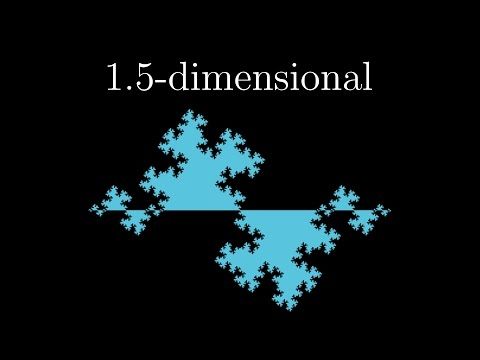
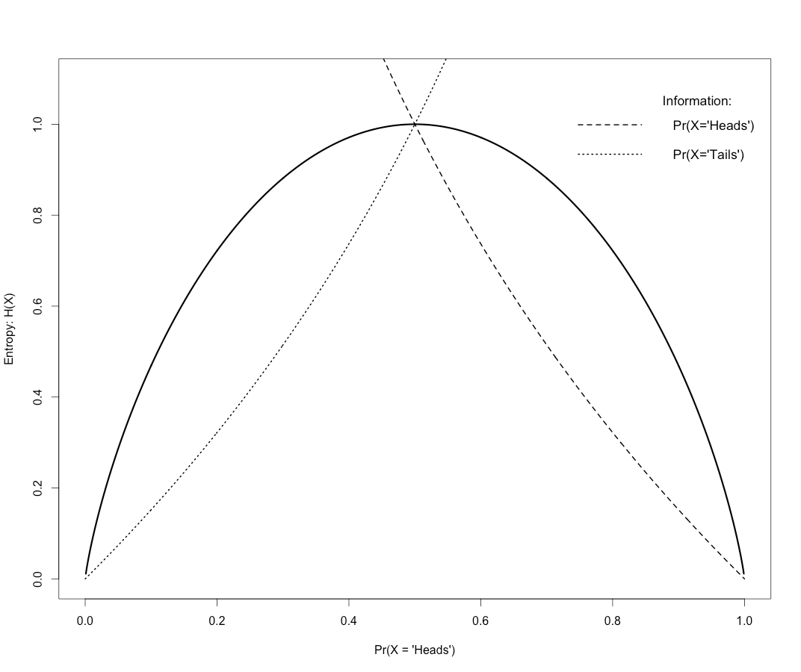
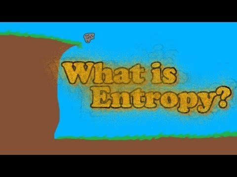
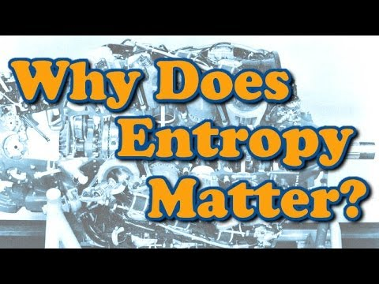

# (PART) Basic (Nonlinear) Time Series Analysis {-} 


# **Basic Time Series Analysis** 

The main purpose of all time series analysis is to quantify patterns in time ordered data. Sometimes these patterns can be derived from by fitting statistical models of change processes to the data, but such analyses will not be the topic of this chapter We will focus on time series analyses that can provide hints about the nature of the data generating process, and not test whether some known model will fit the data.

Most of the techniques we'll discuss can be considered nonlinear time series analyses, we'll start though by looking at the most important linear tools for studying temporal patterns (correlation functions).

First, here is some very important advice you should consider before you get started with time series analysis...


## **Always plot your data!**

Meet *the data saurus dozen*, a stark reminder to always plot your data and never rely on summary statistics only!

(ref:dataSaurus) "The Data Saurus Dozen! Retrieved from: https://www.autodeskresearch.com/publications/samestats" 

```{r dataSaurus, echo=FALSE, message=FALSE, warning=FALSE, paged.print=FALSE, fig.cap='(ref:dataSaurus)'}
if (knitr:::is_latex_output()) {
  knitr::asis_output("\\url{https://d2f99xq7vri1nk.cloudfront.net/DinoSequentialSmaller.gif}")
} else {
  knitr::include_graphics("https://d2f99xq7vri1nk.cloudfront.net/DinoSequentialSmaller.gif")
}
```

> Justin Matejka, George Fitzmaurice (2017)
> Same Stats, Different Graphs: Generating Datasets with Varied Appearance and Identical Statistics through Simulated Annealing
> CHI 2017 Conference proceedings:
> ACM SIGCHI Conference on Human Factors in Computing Systems


## **Correlation Functions**

Correlation functions are intuitive tools for quantifying the temporal structure in a time series. As you know, the correlation measure can only quantify linear regularities between variables, which is why we discuss them here as `basic` tools for time series analysis. So what are the variables? In the simplest case, the variables between which we calculate a correlation are between a data point at time *t* and a data point that is separated in time by some *lag*, for example, if you would calculate the correlation in a lag-1 return plot, you would have calculated the 1st value of the correlation function (actually, it is 2nd value, the 1st value is the correlation of time series with itself, the lag-0 correlation, which is of course $r = 1$). 

Suppose we have a time series $Y_i = {1,2,3,4,5,6,5,4,3,2,1}$,
```{r}
Y <- c(1,2,3,4,5,6,5,4,3,2,1)
plot(ts(Y),type="b")
```

We can create the pairs of lagged values, here we'll study lags from `0` to `4`:

```{r message=FALSE, warning=FALSE, paged.print=FALSE, echo = FALSE}
library(formattable)

laggedseries <- data.frame(Y = Y,
                           lag0 = Y,
                           lag1 = c(Y[2:11],NA),
                           lag2 = c(Y[3:11],NA,NA),
                           lag3 = c(Y[4:11],NA,NA,NA),
                           lag4 = c(Y[5:11],NA,NA,NA,NA))

#colnames(laggedseries) <- c("Y","lag1","lag2","lag3","lag4")

formattable(laggedseries, list(
  lag0 = color_text("violet","violet"),
  lag1 = color_text("lightgreen","lightgreen"),
  lag2 = color_text("lightblue","lightblue"),
  lag3 = color_text("orange","orange"),
  lag4 = color_text("grey50","grey50")))
```


Now we can simply calculate the correlation for each pair of `Y` with a lagged version of `Y`. This is the auto-correlation, because we are basically comparing `Y` with itself, just after some lag of time has passed.

```{r, collapse=TRUE}
(rlag0 <- cor(Y,Y))
(rlag1 <- cor(Y[1:10],Y[2:11]))
(rlag2 <- cor(Y[1:9],Y[3:11]))
(rlag3 <- cor(Y[1:8],Y[4:11]))
(rlag4 <- cor(Y[1:7],Y[5:11]))
```

We can plot these correlations to create the so-called *autocorrelation function* or *ACF*.

```{r, echo = FALSE}
plot(x=0:4,c(rlag0,rlag1,rlag2,rlag3,rlag4),xlab = "lag", ylab = "auto-correlation", type = "l", col="grey70", ylim=c(-1,1))
lines(x=c(0,4),y=c(0,0))
points(x=0:4,c(rlag0,rlag1,rlag2,rlag3,rlag4), pch=16,col=c("violet","lightgreen","lightblue","orange","grey50"),cex=2)
```

The ACF shows a pattern indicating values separated by a step of 1 are positively correlated (of course, at a lag of 0 the correlation is 1). At lag 4 the correlation is negative, if you look at the plot of the time series you can see that for many time steps the values will be on opposite sides of the peak.

We can also decide whether the correlations deviate significantly from 0. If they do, this can be an indication of 'memory', or interdependence: There could be patterns in the data that are recurring with a particular frequency.

In Figure \@ref(fig:sine) the ACF and the *partial* ACF of a sine wave are shown (using function [`plotRED_acf()`](https://fredhasselman.com/casnet/reference/plotRED_acf.html)). The partial auto correlation function, 'partials out' the correlation that is known from the previous lag and displays the unique correlation that exists between data points seperated by the lags.

```{r sine, echo=FALSE, fig.cap="(P)ACF of a sine wave"}
library(cowplot)
y  <- sin(seq(-pi,pi,length.out = 100))
g1 <- ggplot(data.frame(sine=y,time=1:100),aes(y=sine,x=time)) + geom_line() + theme_bw()
g2 <- plotRED_acf(y,Lmax = 80, doPlot = FALSE)
plot_grid(g1,g2,rel_widths = c(2,3))

```


## **Autoregressive models**

In this book we will not discuss the type of linear time series models known as Autoregressive Models (e.g. AR, ARMA, ARiMA, ARfiMA) summarised on [this Wikipedia page on timeseries](https://en.wikipedia.org/wiki/Time_series#Models). There are many extensions to these linear models, check the [`CRAN Task View` on `Time Series Analysis`](https://cran.r-project.org/web/views/TimeSeries.html) to learn more (e.g. about package `zoo` and `forecast`). 

We will in fact be discussing a lot of methods in a book the Wiki page refers to for *'Further references on nonlinear time series analysis'*: [**Nonlinear Time Series Analysis** by Kantz & Schreiber](https://www.cambridge.org/core/books/nonlinear-time-series-analysis/519783E4E8A2C3DCD4641E42765309C7). You do not need to buy this book, to understand what follows, but it can be a helpful reference if you want to go beyond the formal level (= mathematics) used in the CSA-book Some of the packages we use are based on the accompanying software to the book [**TiSEAN**](https://www.pks.mpg.de/~tisean/Tisean_3.0.1/index.html) which is written in `C` and `Fortran` and can be called from the command line (Windows / Linux).


# **Basic Nonlinear Time Series Analysis** 

Many nonlinear analyses can be considered "descriptive" techniques, that is, the aim is not to fit the parameters of a model, but to describe, quantitatively, some aspects of how one value changes into another value over time.


### **Intuitive notion of Fractal Dimension** 

You are probably familiar with the notion of *dimension*, that is, the notion displayed in Figure \@ref(fig:Dimplot) a point has dimension 0, a line dimension 1, a plane dimension 2 and a cube dimension 3.

(ref:Dimplot) "By <a href="//commons.wikimedia.org/wiki/User:NerdBoy1392" title="User:NerdBoy1392">NerdBoy1392</a> - <span class="int-own-work" lang="en">Own work</span>, <a href="https://creativecommons.org/licenses/by-sa/3.0" title="Creative Commons Attribution-Share Alike 3.0">CC BY-SA 3.0</a>, <a href="https://commons.wikimedia.org/w/index.php?curid=5514315">Link</a>"


```{r Dimplot, fig.cap='(ref:Dimplot)', echo=FALSE}
if (knitr:::is_latex_output()) {
  knitr::asis_output("\\url{https://upload.wikimedia.org/wikipedia/commons/4/45/Dimension_levels.svg}")
} else {
  knitr::include_graphics("https://upload.wikimedia.org/wikipedia/commons/4/45/Dimension_levels.svg")
}
```


The fractal dimension of an object indicates how much it 'spills over' into the next integer dimension. Mathematician [Benoît B. Mandelbrot](https://nl.wikipedia.org/wiki/Beno%C3%AEt_Mandelbrot) used it to (formally) study the `roughness` of the world, which was quite revolutionary in mathematics where everything is neat and smooth.

A qualitative description of the fractal dimension of a time series (or 1D curve) can be given by deciding whether the curve looks/behaves like a line, or, like a plane. 

As can be seen in the Figure \@ref(fig:FDplot), if slow processes (low frequencies) dominate the signal, they are more *line-like* (bottom of the figure) and will have a fractal dimension closer to `1`. If fast processes (high frequencies) dominate the signal, they are more *plane-like* and will have a fractal dimension closer to `2`.


```{r FDplot,echo=FALSE, fig.height=10, message=FALSE, warning=FALSE, fig.cap="The fractal dimension of different types of change processes"}
library(casnet)
library(plyr)

N    <- 512
noises <- round(seq(-2,2,by=.5),1)
yy <- llply(noises, function(a){cbind(noise_powerlaw(alpha = a, N = 512, seed = 1234))})
names(yy) <- noises
tmp<- data.frame(yy,check.names = FALSE)
colnames(tmp) <- format(sa2fd_psd(as.numeric(colnames(tmp))),2)

plotTS_multi(tmp, ylabel = "Fractal Dimension")

```

### **Coloured noise**

You can also think of these different types of time-series as being generated by different kinds of processes, they have a different type of correlational structure, what varies is at which time scales the largest correlations can be found. So let's study the correlation functions of these noises, which are often denoted by a colour based on the [colours of the visible light spectrum](https://en.wikipedia.org/wiki/Colors_of_noise.

```{r echo=FALSE, message=FALSE, warning=FALSE}
N    <- 256
noises <- c(-2,-1,0,1,2)
yy <- llply(noises, function(a){cbind(noise_powerlaw(alpha = a, N = N, seed = 1234))})
names(yy) <- noises
rr <- llply(yy, function(a){plotRED_acf(a,doPlot = FALSE)})

tmp<- data.frame(yy,check.names = FALSE)
colnames(tmp) <- c("Red","Pink","White","Blue", "Violet")

plotTS_multi(tmp, ylabel = "Colour of Noise")

```

#### **Brownian (red) noise**
```{r echo=FALSE, message=FALSE, warning=FALSE}
# Brownian noise
rr[[1]]
```

Persistent pattern, correlations exist at all lags, but in the partial acf at lag 1 $r \approx 1$.
Brownian noise is the cumulative sum of white noise, a random walk.

#### **White noise** {-}
```{r echo=FALSE, message=FALSE, warning=FALSE}
# White noise
rr[[3]]
```

No correlations at any lag (except lag 0, where $r= 1$ of course).

#### **Violet noise** {-}
```{r echo=FALSE, message=FALSE, warning=FALSE, paged.print=FALSE}
# Violet noise
rr[[5]]
```

Anti-persistent pattern, correlations exist at all lags, but they change sign. In the partial acf at lag 1 $r \approx -1$.


#### **Fractals** {- #Fractals}

You have probably heard about [*fractals*](https://en.wikipedia.org/wiki/Fractal) as being objects that are made out of little copies of the whole, self-similar objects. The video below provides a good introduction to what fractals are and what they are not, what the *fractal dimension* actually means and it introduces the concept of **roughness*, *scaling* and *box-counting dimension*. We will eventually discuss all these topics, for now it is ok to stop after about 10 minutes.

```{block2, type='rmdimportant'}
*Most fractals are not self-similar*
  

[](https://youtu.be/gB9n2gHsHN4)


```


## **Relative Roughness**


Relative Roughness evaluates the local variability relative to the global variability in a time series. It is calculated using the following formula:    

\begin{equation}
RR = 2*\left[1 - \frac{\gamma_1(x_i)}{Var(x_i)}\right]
(\#eq:RR)
\end{equation}

The numerator in the formula stands for the `lag 1` auto-covariance of the time series $x_i$, this is the unstandardised lag1 autocorrelation (auto-covariance). The denominator stands for the (global) variance of $x_i$ which all statistics packages can calculate. Another way to describe the global variance is: `lag 0` auto-covariance.


You can use Figure \@ref(fig:RRf3) to lookup which value of $RR$ corresponds to which fractal dimension. The line-like time series will have low local variance and high global variance and therefore the Relative roughness will be small. The plane-like time series will have high local variance and low global variance, resulting in a high value for Relative Roughness.

```{r RRf3, fig.cap="Coloured Noise versus Relative Roughness", fig.align='center',echo=FALSE, include=TRUE}
#knitr::include_graphics('images/RRfig3.png')
N    <- 2048
noises <- round(seq(-2,2,by=.1),1)
yy <- llply(noises, function(a){cbind(noise_powerlaw(alpha = a, N = N, seed = 1234))})
names(yy) <- noises
out <- ldply(yy, function(t) fd_RR(y = t))
out$.id <- as.numeric(out$.id)
out$FD <- sa2fd_psd(as.numeric(out$.id))
out$Label <-NA
out$Label[out$.id==-2] <-"Brownian (red) noise"
out$Label[out$.id==-1] <- "Pink noise"
out$Label[out$.id==0] <- "White noise"
out$Label[out$.id==1] <- "Blue noise"
out$Label[out$.id==2] <- "Violet noise"
  
ggplot(out, aes(x=FD,y=V1)) +
         geom_line() +
         geom_point() +
         geom_point(aes(fill = Label, colour = Label), shape = 21,size=4) +
  scale_x_continuous("Fractal Dimension", breaks = seq(1,2,by=.1)) +
  scale_y_continuous("Relative Roughness", breaks = seq(0,4,by=.1)) +
  scale_color_manual("Noise",na.translate=FALSE, values = rep("black",5)) +
  scale_fill_manual("Noise",values=c("Brownian (red) noise"="red3","Pink noise"="pink","White noise"="snow","Blue noise"="skyblue","Violet noise"="purple3"), na.translate = FALSE) +
  theme_bw()
```


## **Entropy**

Entropy is an important topic, but also often a misunderstood concept. See the *Study Materials and Resources* of this chapter for some excellent explanations of this quantity. Here we provide an explanation of Entropy based on its meaning in information theory.

### Physical Information and Entropy {-}

Classical, algorithmic and quantum information theory explicitly exclude meaningful, or, semantic information as part of their explanatory domain (cf. Desurvire, 2009, p. 38), or, as Shannon lucidly explained:

>“The fundamental problem of communication is that of reproducing at one point either exactly or approximately a message selected at another point. Frequently the messages have meaning; that is, they refer to or are correlated according to some system with certain physical or conceptual entities. These semantic aspects of communication are irrelevant to the engineering problem. The significant aspect is that the actual message is one selected from a set of possible messages. The system must be designed to operate for each possible selection, not just the one which will actually be chosen since this is unknown at the time of design.” (Shannon, 1948, p. 379, emphasis in original)

The semantic aspects of a message are irrelevant for reproducing it, if they were relevant for message reproduction, a universal theory of information and communication would not be possible. In order to successfully communicate a message through a channel if semantics were involved, one would have to know particular facts about these correlations with “*some system with certain physical or conceptual entities*”. What then is information?

In the most general terms, information can be defined as a quantity that resolves uncertainty about the state of an information source, a physical entity that can represent an amount of information. The information-theoretic quantity known as self-information, or information content ($I$) quantifies the reduction of uncertainty due to the observation of a particular state of the information source. For example, an information source that can be in 2 states, a fair coin, can represent 2 bits of information (2 things to be uncertain about). Observing 1 of the 2 possible states (‘heads’) resolves uncertainty about the state of the system by an amount of 1 bit of information. 

Another important information-theoretic quantity is entropy ($H$), which can be interpreted as the expected value of $I$ over repeated observations of states of the information source. For a fair coin, the 2 possible states are equiprobable, so the expected amount of information represented by the observation either ‘heads’ or ‘tails’ will be 1. Figure \@ref(fig:entro) displays the relation between the information and entropy represented by each state for different configurations of the coin: Biased towards ‘Tails’ ($Pr(X=Heads)<.5$); fair ($Pr(X=Heads)=.5$); biased towards ‘Heads’ ($Pr(X=Heads)>.5$). The dotted lines show the Information represented by the observation of $X=Heads$ or $X=Tails$.  The entropy is at its maximum $H = 1\ bit/symbol$ when the system is configured to be fair, In that case the observation of each state would represent the same amount of information ($I = 1$). in which case the observation of a particular state does not provide any information about the state that will be observed next, our best guess, is quite literally, to guess. 
 
```{r entro, echo=FALSE, fig.cap="Information and Entropy of a coin system.", message=FALSE, warning=FALSE}

```
 

The maximum entropy state represents maximum unpredictability, in the case of a physical system one would refer to the maximum entropy state as a state of maximum disorder. For now, it is important to note that information is dimensionless in the sense that it does not represent a characteristic scale of observation, but has to be interpreted relative to the scale at which the microscopic states of the system are observed. If a computer scientist and a particle physicist have to estimate the amount of information that is represented by a 1GB memory chip, they will give two different, but correct answers ($2^{33}$ and $\approx2^{76}$ bits, respectively). This is due to the scale at which the degrees of freedom of the information source are identified. The computer scientist cares about the on and off states of the transistors on the chip, whereas the particle physicist is more likely interested in the states of billions of individual particles (example taken from Bekenstein, 2003, p. 59).

A user of a 1GB flash drive commonly wants to know whether there is enough free space to copy one or more files onto it. The amount of free space, expressed as a quantity of information, for example, 100MB, refers to the degrees of freedom at the level of the on and off states of the transistors on the chip that are still available to become “*correlated according to some system with certain physical or conceptual entities*”. We will refer to such degrees of freedom as *non-information bearing d.o.f.*, or, *non-informative structure*, as opposed to *information-bearing d.o.f.*, or, *informative structure*. The latter would concern those transistors whose state is temporarily fixed, because they are part of a specific configuration of transistor states that is associated with one or more systems of physical or conceptual entities (i.e. the state encodes for whatever digital content was stored on the drive). The non-informative structure concerns transistors whose state is not fixed, and would be available to become associated to some other system of entities. Another way to describe this situation, is that there has been a (relative) reduction of the total degrees of freedom available to the system, from $8,589,934,592$ (1GB) to $838,860,800$ (100MB) on/off states. The informative structure represents systematicity, certainty, order: “order is essentially the arrival of redundancy in a system, a reduction of possibilities’’ (von Foerster, 2003). The non-informative structure represents possibility, uncertainty, disorder. 

These quantities of information can be used to distinguish one system state relative to another (e.g. less or more redundancy/possibility, order/disorder, unavailable/available storage space), and this can lead to the emergence of identity (cf. Kak, 1996). However, this is not the same as the emergence of meaning, that is, it the quantity does not account for the emergence of informative structure, which would require knowledge about the system with which the configuration of degrees of freedom became associated. The amount of information represented by an information source does not specify what it codes for, it is meaningless (cf. Küppers, 2013). To ‘make use’ of the meaning encoded in an information source one would need to be able learn the systemic regularities it codes for by observing how the redundancies came about, or, figure out how to translate the configuration into another, known code (an equivalent to the Rosetta stone). Compared to the concept of internal or mental representation, the physical representation of information is much more an indication of a capacity for registering an amount of information (Lloyd, 2006). It refers to a potential for establishing a new order in the configuration of the system by recruiting available degrees of freedom, whereas the mental representations the post-cognitivists seek to dispense with, refer to previously realized order that was somehow trapped, stored, or imprinted into the structure of the system. 


### Entropy in time series {-}

To estimate the entropy of an observed time series, we need some method for deciding how predictable the series is, what are the redundancies in the series we can exploit in order to know what is going to happen next? We'll use a measure called Sample Entropy or *SampEn*, which can be interpreted as measuring the average amount of information that is needed in order to represent all the (patterns) of values observed in the time series. If we need lots of information, this means the time series is unpredictable, random and the SampEn will be high. If we need just a few bits of information, this means the time series is very predictable, deterministic and the SampEn will be low.

More formally: Sample entropy is the negative natural logarithm of the conditional probability that a dataset of length $N$, having repeated itself within a tolerance $r$ for $m$ points, will also repeat itself for $m+1$ points. 

 $P = \frac{distance\ between\ values\ in\ data\ segment\ of\ length\ m+1\ <\ r}{distance\ between\ values\ in\ data\ segment\ of\ length\ m\ <\ r}$   

$SampEn = −\log P$   

Figure \@ref(fig:sampEnt) can be used to lookup which value of `SampEn` corresponds to which type of dynamics. As expected, white noise has the highest SampEn, it is the most unpredictable type of noise. The other noises, towards (infra) red and (ultra) violet noise are characterised by increasingly dominant high and low frequency oscillations, which are redundancies, and they make the behaviour of the series predictable.

```{r sampEnt, echo=FALSE, fig.align='center', fig.cap="Coloured Noise versus Sample Entropy", message=FALSE, warning=FALSE}
#knitr::include_graphics('images/RRfig3.png')
N    <- 1024
noises <- round(seq(-2,2,by=.1),1)
yy <- llply(noises, function(a){cbind(noise_powerlaw(alpha = a, N = N, seed = 1234))})
names(yy) <- noises
out <- ldply(yy, function(t) pracma::sample_entropy(ts = t, edim = 3, r = sd(t)))
out$.id <- as.numeric(out$.id)
out$FD <- sa2fd_psd(as.numeric(out$.id))
out$Label <-NA
out$Label[out$.id==-2] <-"Brownian (red) noise"
out$Label[out$.id==-1] <- "Pink noise"
out$Label[out$.id==0] <- "White noise"
out$Label[out$.id==1] <- "Blue noise"
out$Label[out$.id==2] <- "Violet noise"
  
ggplot(out, aes(x=FD,y=V1)) +
         geom_line() +
         geom_point() +
         geom_point(aes(fill = Label, colour = Label), shape = 21,size=4) +
  scale_x_continuous("Fractal Dimension", breaks = seq(1,2,by=.1)) +
  scale_y_continuous("Sample entropy (edim = 3, r = SD)", breaks = seq(0,4,by=.1)) +
  scale_color_manual("Noise",na.translate=FALSE, values = rep("black",5)) +
  scale_fill_manual("Noise",values=c("Brownian (red) noise"="red3","Pink noise"="pink","White noise"="snow","Blue noise"="skyblue","Violet noise"="purple3"), na.translate = FALSE) +
  theme_bw()
```


## **Other measures in _casnet_**

Check the functions 

[fd_boxcount2D](https://fredhasselman.com/casnet/reference/fd_boxcount2D.html)

[fd_allan](https://fredhasselman.com/casnet/reference/fd_allan.html)

[fd_sev](https://fredhasselman.com/casnet/reference/fd_sev.html)


## *Study Materials and Resources* {-}

### Notes on Entropy {-}


```{block2, type='rmdimportant'}

**What is entropy?**

[](https://youtu.be/ykUmibZHEZk)


**Why does entropy even matter?**

[](https://youtu.be/qQhv3YhiJ98)


```


```{block2, type='rmdselfThink'}

**A better explanation of entropy**


[](https://youtu.be/w2iTCm0xpDc)

```


