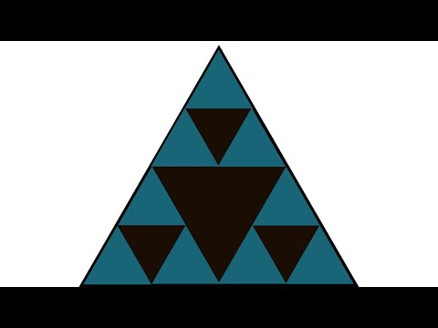

# (PART) Scaling Phenomena - Fluctuation Analyses {-}     

# **Fluctuation Analyses: Global Scaling**

> “If you have not found the 1/f spectrum, it is because you have not waited long enough. You have not looked at low enough frequencies.”     
> [- Machlup (1981)]{style="float:right"}

As @machlup1981 noted, in order to find long range temporal correlations, you need to be able to observe them, that is, observe the process for a sufficiently long time. In general, variables measured from Complex Adaptive Systems will display long-range correlations [for examples in behavioural science see e.g. @Gilden2001a, @VanOrden2005a, @Kell02008a, @Wijnants2009a, @Wijnants2012b, @olthof2020a]. What the presence of such correlations, and specifically the pattern known as 1/f noise (pink noise), signifies is a matter of debate. This chapter lists some of the methods available in package `casnet` to quantify the presence of temporal patterns that can be associated to the different colours of noise discussed in the previous chapter. Most analysis outcomes can be converted to an estimate of the Fractal Dimension of the time series [see @Hasselman2012a for rationale and conversion formula's].

If you haven't done so already, it is recommended you study the materials listed in the paragraph [**Fractals**](#Fractals) of the previous chapter.

```{block2, type='rmdimportant'}

The presence of power-law scaling means that the observed time series (and potentially the data generating process) cannot be described by referring to a characteristic scale. This can be a scale of fluctuation (e.g. a population variance) or a central tendency (e.g. a population mean). However, we do not know anything about the mechanism responsible for the emergence of the powerlaw. This is explained in the video linked below. Other useful resources are:     
  
* Scaling laws in cognitive sciences. [@Kello2010a]     
* A Review of Theoretical Perspectives in Cognitive Science on the Presence of 1/f Scaling in Coordinated Physiological and Cognitive Processes. [@Wijnants2014]    
* Fractal dynamics in physiology: Alterations with disease and aging. [@Goldberger2002a]    
* Living in the Pink: Intentionality, Wellbeing, and Complexity. [@VanOrden2009a]    
      
     
**Fractals and Scaling: What do power laws mean?**     
      
[](https://youtu.be/A9TPf7cBWBs)

```


## **Power Spectral Density (PSD) slope**

Power Spectral Density slope analysis first transforms the time series into the frequency domain by performing the [Fourier transform](https://en.wikipedia.org/wiki/Fourier_transform). This breaks down the signal into sine and cosine waves of a particular amplitude that together "add-up" to represent the original signal. If there is a systematic relationship between the frequencies in the signal and the power of those frequencies (power = amplitude^2), this will reveal itself in log-log coordinates as a linear relationship. The slope of the best fitting line is taken as an estimate of the scaling exponent and can be converted to an estimate of the fractal dimension.


Package `casnet` contains a dataset called `ColouredNoise`, the column names represent the scaling exponent of the time series simulated with `noise_powerlaw()`.

```{r PSDslope, echo=TRUE, message=FALSE, warning=FALSE, paged.print=FALSE}
plotTS_multi(ColouredNoise)
```

Data preparation usually involves the steps required for conducting the Fourier analysis. This includes centring on the mean (or standardising) and detrending the time series (the Fourier transform is a linear technique which assumes stationarity).

Calling `fd_psd()` will produce a summary output in the console. For all functions of the `fd_` family, two scaling exponents will be estimated, one based on the entire range of data points that represent a potential powerlaw, and one based on a restricted range. In the case of the spectral slope, it is custom to fit only over the scaling region in the lower frequencies (for negative scaling exponents) or higher frequencies (for positive scaling exponents). See the `fitMethod` argument in the manual for an explanation of the options for selecting a range of frequencies.

```{r fd_psd, echo=TRUE, fig.height=9, fig.width=7, message=FALSE, warning=FALSE, paged.print=FALSE}
psdN1 <- fd_psd(ColouredNoise$`-1`, returnPlot = TRUE, tsName = "Pink noise", noTitle = TRUE, doPlot = FALSE)
psd0 <- fd_psd(ColouredNoise$`0`, returnPlot = TRUE, tsName = "White noise", noTitle = TRUE, doPlot = FALSE)
psdP1 <- fd_psd(ColouredNoise$`1`, returnPlot = TRUE, tsName = "Blue noise", noTitle = TRUE, doPlot = FALSE)

cowplot::plot_grid(psdN1$plot,psd0$plot,psdP1$plot,ncol = 1)
```

The sample time series were generated using the inverse Fourier transform. Therefore, the `fd_psd()` estimates are expected to yield most accurate estimates the scaling exponent. Let's see how other approaches do.    


## **Standardised Dispersion Analysis (SDA)** 

In Standardised Dispersion Analysis, the time series is converted to z0scores (standardised) and the way the average standard deviation (SD) calculated in bins of a particular size scales with the bin size should be an indication of the presence of power-laws. That is, if the bins get larger and the variability decreases, there probably is no scaling relation. If the SD systematically increases either with larger bin sizes, or, in reverse, this means the fluctuations depend on the size of the bins, the size of the measurement stick.


```{r fd_sda, echo=TRUE, fig.height=9, fig.width=7, message=FALSE, warning=FALSE, paged.print=FALSE}
sdaN1 <- fd_sda(ColouredNoise$`-1`, doPlot = FALSE, returnPlot = TRUE, tsName = "Pink noise", noTitle = TRUE)
sda0  <- fd_sda(ColouredNoise$`0`, doPlot = FALSE, returnPlot = TRUE, tsName = "White noise", noTitle = TRUE)
sdaP1 <- fd_sda(ColouredNoise$`1`, doPlot = FALSE, returnPlot = TRUE, tsName = "Blue noise", noTitle = TRUE)

cowplot::plot_grid(sdaN1$plot,sda0$plot,sdaP1$plot,ncol = 1)
```


## **Detrended Fluctuation Analysis (DFA)**
     
The procedure for Detrended Fluctuation Analysis is similar to SDA, except that within each bin, the signal is first detrended, what remains is then considered the residual variance. The logic is the same, the way the average residual variance scales with the bin size should be an indication of the presence of power-laws. There are many different versions of DFA, one can choose to detrend polynomials of a higher order, or even detrend using the best fitting model, which is decided for each bin individually. See the manual pages of `fd_dfa()` for details.


```{r fd_dfa, echo=TRUE, fig.height=9, fig.width=7, message=FALSE, warning=FALSE, paged.print=FALSE}
dfaN1 <- fd_dfa(ColouredNoise$`-1`, doPlot = FALSE, returnPlot = TRUE, tsName = "Pink noise", noTitle = TRUE)
dfa0  <- fd_dfa(ColouredNoise$`0`, doPlot = FALSE, returnPlot = TRUE, tsName = "White noise", noTitle = TRUE)
dfaP1 <- fd_dfa(ColouredNoise$`1`, doPlot = FALSE, returnPlot = TRUE, tsName = "Blue noise", noTitle = TRUE)

cowplot::plot_grid(dfaN1$plot,dfa0$plot,dfaP1$plot,ncol = 1)
```

        
## **Other varieties of fluctuation analysis**

Check the [`casnet` manual](https://fredhasselman.com/casnet/reference/index.html) for other functions in the `fd_` family!


## *Study Materials and Resources* {-}

### Systems Innovation {-}

The [Systems Innovation](https://systemsinnovation.io) platform has lots of resources on Complex Systems, Complex Networks and related topics. Their [YouTube channel](https://www.youtube.com/channel/UCutCcajxhR33k9UR-DdLsAQ) contains a wealth of informative videos. 

```{block2, type='rmdimportant'}

[](https://youtu.be/NrH3RZ2me6Y)

```


```{block2, type='rmdimportant'}

[](https://youtu.be/pbu80EEnh8E)

```


        

