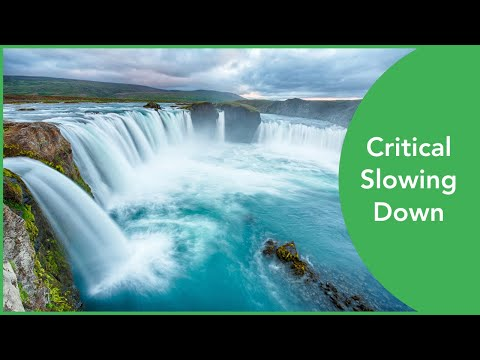

# (PART) Multivariate Timeseries Analysis {-}

# **Vector Auto Regression (VAR)**

# **Dynamic Complexity**


## *Study Materials and Resources* {-}

### Systems Innovation {-}

The [Systems Innovation](https://systemsinnovation.io) platform has lots of resources on Complex Systems, Complex Networks and related topics. Their [YouTube channel](https://www.youtube.com/channel/UCutCcajxhR33k9UR-DdLsAQ) contains a wealth of informative videos. 

```{block2, type='rmdimportant'}

[](https://youtu.be/AQoCwWK7j6k)

```


# **Graph Theory and Complex Network Analysis**

kjkjkjkj

## **Recurrence Networks** 


## **Networks based on Multidimensional RQA**


## **Transition Networks**


kjkjkj
